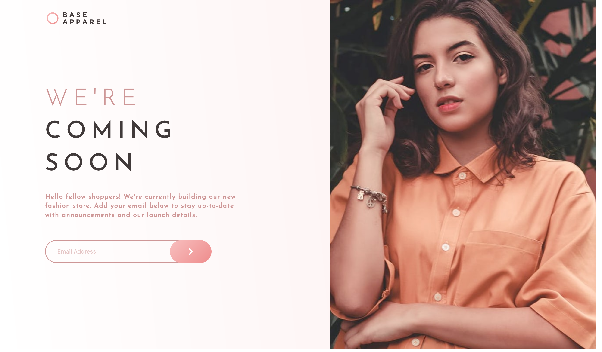
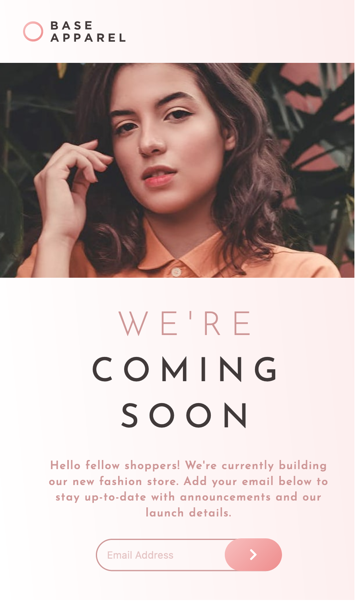

# Project: Base Apparel Landing Page

## **About Project**

Base Apparel is an apparel company with a brand and ecommerce page under construction. This project is a landing page for Base Apparel, using 'Frontend Mentor' for inspiration.

[Live Demo](https://lpasqualone.github.io/base-apparel/)👈

### **Technologies and Tools Used**

* HTML
* CSS
* JavaScript
* Figma (For reference, product design specifications)

### **Emphasized Concepts**

1. Responsive Web Design

*Process involved:*
  - Taking a <strong>mobile-first</strong> approach in creating the design
  - Making the website scale cleanly on all devices between **1440px to 320px**, viewable for standard laptops to any size mobile device.

*CSS Flexbox and Grid*

*Design changes based on different screen sizes*

 

## **Summary**

**What I know**
* Confident with DOM manipulation, writing clean and efficient code
* Confident with responsive design, moving elements around for size/placement shift
* JavaScript for interactive elements

**Where I can grow**
* Learn basic backend to help set up email marketing structure. Not required of this project, but goals for future growth steps

## **Screenshots**

**Desktop** 

**Mobile**

 

### **Links**

- [Frontend Mentor Solution](https://www.frontendmentor.io/solutions/base-apparel-landing-page-Zz9hAgO4Y)
- Author: [@lpasqualone](https://www.frontendmentor.io/profile/lpasqualone)
